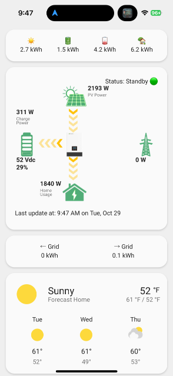

# Lux Power Distribution Dashboard for Home Assistant

**tldr:** This guide provides everything you need to do to set up a simple Dashboard in Home Assistant to securely monitor your EG4 solar inverter in real-time.

## Table of Contents
- [Lux Power Distribution Dashboard for Home Assistant](#lux-power-distribution-dashboard-for-home-assistant)
- [Prerequisites](#prerequisites)
- [Setup Overview](#setup-overview)
  - [1. Configure Your Dashboard View](#1-configure-your-dashboard-view)
  - [2. Adjust the Time Display](#2-adjust-the-time-display)
- [Appendix: Server Setup Scripts, Home Assistant and MQTT Configuration](#appendix-server-setup-scripts-home-assistant-and-mqtt-configuration)
  - [Mosquitto Password and File Directory Configuration](#mosquitto-password-and-file-directory-configuration)
  - [Setup Folder for Home Assistant](#setup-folder-for-home-assistant)
  - [Server Setup Script](#server-setup-script)
  - [Docker Compose Configuration](#docker-compose-configuration)
- [Directory Structure and Files](#directory-structure-and-files)
- [Additional Notes About my Setup](#additional-notes-about-my-setup)
- [Optional: EG4 Dashboard Settings](#optional-eg4-dashboard-settings)
- [Optional: Secure MQTT Relay Setup on macOS over Tailnet 🔐](#optional-secure-mqtt-relay-setup-on-macos-over-tailnet-)
  - [Steps to Set Up the Relay](#steps-to-set-up-the-relay)
- [Troubleshooting Homebrew Services Issue](#troubleshooting-homebrew-services-issue)

---
This repository provides a [Home Assistant](https://www.home-assistant.io) dashboard view for monitoring your [EG4 EG4 18kPV Hybrid Inverter](https://eg4electronics.com/categories/inverters/eg4-18kpv-12lv-all-in-one-hybrid-inverter/) solar power system. It requires, amongst other things, the [Lux Power Distribution Card](https://github.com/DanteWinters/lux-power-distribution-card) and a [monitormy.solar dongle](https://monitormy.solar/detail/13).

The dashboard assumes:
1. You've integrated the **monitormy.solar dongle** with Home Assistant.
2. You want the view shown in the screenshot below:



### Misc Icon Descriptions:
- ☀️ **Solar yield from all arrays (today)**  
- 🔋 **How much all batteries were charged (today)**  
- 🪫 **How much all batteries were drained (today)**  
- 🏡 **How much total power the home consumed (today)**  
- ← **Grid: How much energy was used from the grid (today)**  
- → **Grid: How much energy was sent to the grid (today)**

Note: Additional grid indicators explained [here](https://github.com/DanteWinters/lux-power-distribution-card?tab=readme-ov-file#grid-indicators)

---
## Prerequisites

1. **Home Assistant**  
   Ensure [Home Assistant](https://www.home-assistant.io) is installed and running. [Home Assistant Docker Compose setup](https://pimylifeup.com/home-assistant-docker-compose/) is a helpful guide that covers installing Home Assistant and [Eclipse MQTT](https://mosquitto.org).

2. **Monitormy.solar Dongle for the EG4**  
   You'll need to purchase and setup the 3rd party [MonitorMy Solar Dongle](https://monitormy.solar/detail/13) to access [data exposed by your EG4 inverter](https://docs.google.com/document/d/e/2PACX-1vTFpUI4iIP24MljyPgWWKkZb1AWCMIvXzGQcCLPElrDjqb-yIiRrRGXlAGkQ45x7axkOXBBWUm76M7e/pub).  

3.	**Eclipse MQTT**  
   Eclipse MQTT is required to subscribe to the data transmitted by the dongle. Although the setup is explained in the [HA Docker Compose setup guide](https://pimylifeup.com/home-assistant-docker-compose/), you’ll also need to create a password file for the dongle to communicate with the broker. The guide does not cover the password setup, but additional information can be found in the **Appendix** section.

5. **MQTT Integration in Home Assistant**  
   Configure the **[MQTT Broker](https://www.home-assistant.io/integrations/mqtt/)** integration in Home Assistant to receive data from Eclipse MQTT.

6. **HACS (Home Assistant Community Store)**  
   Install [HACS](http://hacs.xyz) in Home Assistant to add custom 3rd party integrations. This is required to install the Monitor My Solar Integration and the Lux Power Distribution Card.

7. **Monitor My Solar Integration via HACS**  
   Install MonitorMy.Solar through HACS for seamless data integration from your solar setup. Technically, they also have a [GitHub repo](https://github.com/zakery292/monitormysolar) but there's no need to install this way since it's published in the HACS store.

8. **Lux Power Distribution Card via HACS**  
   Install the custom card from [Dante Winters' repository](https://github.com/DanteWinters/lux-power-distribution-card). Thanks to Dante Winters for integrating the LuxPower animation and business logic. It works perfectly with the MonitorMy.Solar dongle when connected to the correct sensor states which are pre-configured in `lux.yaml`.

9. **Simple Weather Card via HACS**  
   Install the Simple Weather card to get todays weather data for your home.

10. **Rquired for EG4 Dashboard Settings (which is optional): Lovelace Card Mod3**
   Install [lovelace-card-mod](https://github.com/thomasloven/lovelace-card-mod) through HACS to apply CSS styles to various elements of the Home Assistant frontend dashboards.

---

## Setup Overview

After installing and configuring the prerequisites the setup for this dashboard consists of two steps:

### 1. Configure Your Dashboard View  
To display the dashboard correctly, you need to modify the `lux.yaml` configuration.

#### **`lux.yaml` Configuration (Required for View)**  
You’ll need to replace every instance of the **dongle MacID** (`dongle_40_4c_ca_4c_XX_XX`) with your own unique dongle MacID.  
- **Where to Find Your MacID:**  
  - Available via **Home Assistant** under the MQTT sensors.
  - Can also be retrieved from the portal running on the **monitormy.solar dongle**.

Once the prerequisites are satisfied, copy and paste the content of `lux.yaml` into a dashboard view in Home Assistant.

---

### 2. Adjust the Time Display  
The `lux.yaml` dashboard view provides a **cleaner and more readable timestamp** than the default **Last Bank Update** from the monitormy.solar dongle (which defaults to UTC time and shows microseconds). By default, `lux.yaml` uses a template sensor to format the timestamp. You can skip this step if you prefer, but you’ll need to modify the configuration to use the raw timestamp instead. 

#### **Time Zone Configuration (Optional but very nice)**  
Add the following to your `configuration.yaml` in Home Assistant to convert the UTC timestamp from the dongle into your local time zone. This example formats the time in **Pacific Standard Time (PST)** and omits seconds for simplicity. Note: you will need to update this with your MacID.

```yaml
template:
  - sensor:
      - name: "Last Bank Update (Formatted)"
        state: >
          
          {% set pst_time = utc_time | as_timestamp | timestamp_custom('%-I:%M %p on %a, %b %-d', true) %}
          {{ pst_time }}
```

The formatted timestamp will now display as:  
```
9:30 AM on Mon, Oct 27 
```

> **Important Note:**  
If you decide **not** to use the formatted timestamp, you will need to modify `lux.yaml` to reference the raw timestamp directly. Replace:  
```yaml
sensor.last_bank_update_formatted
```
with this and update it with your MacID:  
```yaml
sensor.dongle_40_4c_ca_4c_XX_XX_last_bank_update
```
---

## Appendix: Server Setup Scripts, Home Assistant and MQTT Configuration
Should it provide useful below are the setup scripts and configuration details used for my environment.

### Mosquitto Password and File Directory Configuration
_This was used to set up Mosquitto on the VM. Since I installed everything in `/opt`, you will want to change to that directory before running these commands if you intend to use the same location._

**1. Set Up Directories and Permissions**  
The Mosquitto Docker container is configured to run with a **specific user and group**, both assigned the **UID and GID of 1883**. This ensures consistent ownership and access control within the container.

Use the following commands to create the necessary directories, user, and group, and assign the correct permissions:

```bash
# Create required directories for Mosquitto
sudo mkdir -p mosquitto/config mosquitto/data mosquitto/log

# Create the 'mosquitto' group with GID 1883
sudo groupadd -g 1883 mosquitto

# Create the 'mosquitto' user with UID 1883 and assign to the 'mosquitto' group
sudo useradd -u 1883 -g 1883 mosquitto

# Assign ownership of the directories to the 'mosquitto' user and group
sudo chown -R mosquitto: /opt/mosquitto
```

This setup ensures that the Mosquitto container has the necessary permissions to access its configuration, data, and log files.


**2. Install Mosquitto:**  
   _This was necessary for me to setup a Mosquitto password file and is not part of the Docker Compose install I am sharing below._
   ```bash
   sudo apt update
   sudo apt install mosquitto
   ```

**3. Create Password File:**  
   _This command will create a password file from which you can retrieve your password. Replace <username> with the desired username you want to use with your MQTT broker._
   ```bash
   mosquitto_passwd -c /mosquitto/config/password_file <username>
   ```

**4. Create /opt/mosquitto/config/mosquitto.conf:**  
   _This enables data persistence and specifies the location for Mosquitto to log data._
```
persistence true
persistence_location /mosquitto/data/
log_dest file /mosquitto/log/mosquitto.log
log_dest stdout
log_type all
listener 1883
protocol mqtt
listener 9001
protocol websockets
allow_anonymous false
password_file /mosquitto/config/password_file
```
   
**5. MQTT Debugging Tool:**  
   Use [MQTTX](http://mqttx.app) to test and debug MQTT connections.

### Setup Folder for Home Assistant
_Create the root folder for Home Assistant before installing with server setup script._

```
sudo mkdir -p /opt/homeassistant_config
```

### Server Setup Script
_This was used to install Docker and Tailscale. Should you install Tailscale you will need to uncomment that line. Also, additional steps required to configure Tailscale. For example, [on GCP follow this Tailscale setup guide](https://tailscale.com/kb/1147/cloud-gce)._

Create `/opt/setup_server.sh`:

```bash
#!/bin/bash
# Update and Install Dependencies
sudo apt-get update
sudo apt-get install -y ca-certificates curl gnupg lsb-release

# Add Docker's GPG key and Repository
sudo install -m 0755 -d /etc/apt/keyrings
curl -fsSL https://download.docker.com/linux/ubuntu/gpg | sudo gpg --batch --yes --dearmor -o /etc/apt/keyrings/docker.gpg
sudo chmod a+r /etc/apt/keyrings/docker.gpg
echo "deb [arch=$(dpkg --print-architecture) signed-by=/etc/apt/keyrings/docker.gpg] https://download.docker.com/linux/ubuntu $(lsb_release -cs) stable" | sudo tee /etc/apt/sources.list.d/docker.list > /dev/null

# Install Docker and Tailscale
sudo apt-get update
sudo apt-get install -y docker-ce docker-ce-cli containerd.io docker-buildx-plugin docker-compose-plugin
# curl -fsSL https://tailscale.com/install.sh | sh

# Start and Enable Docker
sudo systemctl start docker
sudo systemctl enable docker

# Run Docker Compose
cd /opt
sudo docker compose build --no-cache
sudo docker compose up -d
```

### Docker Compose Configuration
_This was used to install Home Assistant and Mosquitto._

Create `/opt/docker-compose.yml`:

```yaml
services:
  homeassistant:
    container_name: homeassistant
    image: "ghcr.io/home-assistant/home-assistant:stable"
    volumes:
      - ./homeassistant_config:/config
      - /etc/localtime:/etc/localtime:ro
    restart: unless-stopped
    network_mode: host

  mosquitto:
    image: eclipse-mosquitto
    container_name: mosquitto
    restart: unless-stopped
    ports:
      - 1883:1883
      - 9001:9001
    volumes:
      - ./mosquitto/config:/mosquitto/config
      - ./mosquitto/data:/mosquitto/data
      - ./mosquitto/log:/mosquitto/log
      - ./password_file:/mosquitto/config/password_file
    environment:
      - TZ=America/Los_Angeles
    user: "1883:1883"
```
---
## Directory Structure and Files
This structure mirrors my Home Assistant setup on the VM, including where my Docker Compose file, Setup script and MQTT integration live (along with a few additional components which I installed but are not detailed here).

```
/opt
├── configurator-config/
├── containerd/
├── docker-compose.yml
├── hass-config/
│   └── configuration.yaml
├── homeassistant_config/
│   ├── automations.yaml
│   ├── backups/
│   ├── blueprints/
│   ├── configuration.yaml
│   ├── custom_components/
│   ├── deps/
│   ├── home-assistant.log
│   ├── home-assistant.log.1
│   ├── home-assistant.log.fault
│   ├── home-assistant_v2.db
│   ├── home-assistant_v2.db-shm
│   ├── home-assistant_v2.db-wal
│   ├── scenes.yaml
│   ├── scripts.yaml
│   ├── secrets.yaml
│   ├── themes/
│   ├── tts/
│   ├── ui_lovelace_minimalist/
│   ├── wget-log
│   └── www/
├── mosquitto/              (directory, owned by mosquitto user)
│   ├── config/
│   │   ├── mosquitto.conf
│   │   └── password_file
│   ├── data/
│   │   └── mosquitto.db
│   └── log/
│       └── mosquitto.log
├── password_file
└── setup_server.sh
```

### Breakdown of New Directories and Files

#### `/opt/mosquitto/config/`:
- **`mosquitto.conf`**: Configuration file for the Mosquitto MQTT broker.
- **`password_file`**: Contains authentication credentials for Mosquitto.

#### `/opt/mosquitto/data/`:
- **`mosquitto.db`**: MQTT data persistence file.

#### `/opt/mosquitto/log/`:
- **`mosquitto.log`**: Log file tracking the Mosquitto broker’s activities.

#### `/opt/homeassistant_config/`:
- **`configuration.yaml`**: Primary configuration file for Home Assistant.
- **`home-assistant_v2.db`**: Core database for Home Assistant.
- **`automations.yaml`**: Stores automation rules.
- **`custom_components/`**: Directory for custom integrations or components.
- **`themes/`** and **`tts/`**: Directories for themes and text-to-speech files.
- **`secrets.yaml`**: Secure storage for sensitive data.
- **`ui_lovelace_minimalist/`**: Ui Lovelace Minimalist custom UI configuration.
- **`www/`**: Web-accessible files.
---

## Additional Notes About my Setup

- **Firewall:** Since the dongle isn’t connected to my Tailscale network, and I’m running Home Assistant in a VM, I have configured GCP’s firewall to open port 1883 exclusively for my home IP address, enabling MQTT communication. *
- **Tailscale:** I am using Tailscale to securely access my cloud-hosted Home Assistant instance only for people on my tailnet.
- **Why Two password_files?:** Not sure—I probably created one in the root directory by mistake. I could delete the one in root, but I’d rather not mess with something that’s working. 😄
- **Sending Data Securely to the VM** I reconfigured the dongle to transmit its data to a local MQTT broker on my Tailscale network, which relays it to my cloud-based Home Assistant VM. After setting this up, I restricted the MQTT port on the VM to allow only Tailscale traffic. The steps for this configuration are detailed below under _Optional: Secure MQTT Relay Setup on macOS over Tailnet_. Additionally, I’ve disabled the dongle’s access to anything other than my MQTT broker, stopping it from sharing data with EG4.

---
### Optional: Secure MQTT Relay Setup on macOS over Tailnet 🔐
This guide explains how to configure a Mac mini on your Tailscale network as an MQTT relay, allowing local data transmission from the dongle to the Mac mini without encryption, and securely forwarding the data from the Mac mini to a Tailscale-connected VM.

#### **Prerequisites:**
- Tailscale installed and connected on both the Mac mini and VM.
- The Mac mini is accessible on the same local network as the dongle.

---

### **Steps to Set Up the Relay**

1. **Install Mosquitto on macOS:**
   ```bash
   brew install mosquitto
   brew services start mosquitto
   ```

2. **Configure Mosquitto to Relay MQTT Data:**
   Open the Mosquitto config file:
   ```bash
   nano /usr/local/etc/mosquitto/mosquitto.conf
   ```

   Add the following configuration making sure to **use the Tailscale IP of the VM** not the public IP:
   ```conf
   # Listener for local MQTT traffic
   listener 1883 0.0.0.0
   allow_anonymous false

   # Bridge configuration to relay to Tailscale VM
   connection tailscale_bridge
   address <TAILSCALE_VM_IP>:1883
   remote_username <MQTT_USERNAME>
   remote_password <MQTT_PASSWORD>
   topic # both 0
   ```

3. **Restart Mosquitto:**
   ```bash
   brew services restart mosquitto
   ```

4. **Configure the Dongle:**
   - **MQTT Server**: IP of the Mac mini (e.g., `192.168.x.x`)
   - **Port**: 1883  
   - **Credentials**: set to `allow_anonymous false` since a username/password is required and is more secure.

5. **Update the GCP Firewall Rule:**
   - In the Google Cloud Console, go to VPC network → Firewall rules and update the existing rule. Since Tailscale IPs are stable but not guaranteed to be static, it’s recommended to allow the entire Tailscale subnet in your GCP firewall rule to ensure consistent connectivity. While you can use the Mac mini’s specific Tailscale IP, be aware that it could change, requiring you to update the rule if it stops working.
   ```bash
   100.64.0.0/10
   ```
6. **Verify Communication:**
   - From the VM, subscribe to all topics:
     ```bash
     mosquitto_sub -h <VM_IP> -p 1883 -u <MQTT_USERNAME> -P <MQTT_PASSWORD> -t "#"
     ```
   - From the dongle or Mac mini, publish a test message:
     ```bash
     mosquitto_pub -h 192.168.x.x -p 1883 -t "test/topic" -m "Hello MQTT!"
     ```

---

### **Optional: EG4 Dashboard Settings**
_This requires installing [lovelace-card-mod](https://github.com/thomasloven/lovelace-card-mod) through HACS to apply CSS styles._

I wanted a list of all EG4 settings exposed in Home Assistant on a single page so I created [dashboard_settings.yaml](https://github.com/danielraffel/luxpower-dashboard/blob/main/dashboard_settings.yaml)

I got the list of items by running this command using my dongle serial in [HA DevTools](https://www.home-assistant.io/docs/tools/dev-tools/)
```

  
    {{ state.name }}
    {{ state.entity_id }}
  

```

This dashboard displays around 240 settings in a top-level read-only view, complete with tooltips that are exposed on desktop. By tapping on a setting, you can adjust it, view graphs, access entity names, and more. Handy alternative to the EG4 monitoring site.


---


### **Troubleshooting Homebrew Services Issue**

On macOS, if you encounter the following error during the Mosquitto installation:  
```bash
brew services start mosquitto
==> Tapping homebrew/services
fatal: destination path '/usr/local/Homebrew/Library/Taps/homebrew/homebrew-services' already exists and is not an empty directory.
Error: Failure while executing; git clone https://github.com/Homebrew/homebrew-services /usr/local/Homebrew/Library/Taps/homebrew/homebrew-services --origin=origin --template= --config core.fsmonitor=false exited with 128.
Error: Failure while executing; /usr/local/bin/brew tap homebrew/services exited with 1.
```

**Solution:**

1. **Remove the conflicting `homebrew-services` tap:**
   ```bash
   rm -rf /usr/local/Homebrew/Library/Taps/homebrew/homebrew-services
   ```

2. **Reinstall the tap:**
   ```bash
   brew tap homebrew/services
   ```

3. **Start the Mosquitto service again:**
   ```bash
   brew services start mosquitto
   ```

4. **Verify Mosquitto is running:**
   ```bash
   brew services list
   ```
---

Enjoy monitoring your solar system with this customized dashboard and more secure Tailscale setup! 🚀
